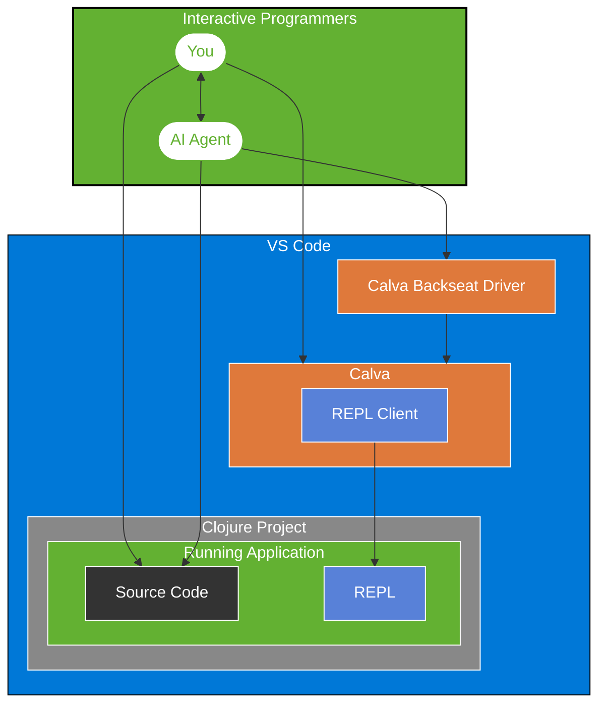

# Make CoPilot an Interactive Programmer

Clojure Tools for CoPilot

> It is also a Calva Backseat Driver

(Parts of this README is written by Claude Sonnet. Pardon any marketing language. I will clean up.)

[](https://marketplace.visualstudio.com/items?itemName=betterthantomorrow.calva-backseat-driver)
[](https://github.com/BetterThanTomorrow/calva-backseat-driver/issues)
[](https://github.com/BetterThanTomorrow/calva-backseat-driver/blob/master/LICENSE.txt)

An VS Code Language model extension for [Calva](https://calva.io), the Clojure/ClojureScript extension for VS Code, enabling AI assistants to harness the power of the REPL.

This extension exposes the AI tools both to CoPilot directly, using the VS Code Language Model API, and via an optional MCP server for any AI assistants/agents.

## Features

* Tool: **Evaluate Code** (disabled by default), access to the Clojure REPL to evaluate code at will
* Tool: **Symbol info lookup**, the AI can look up symbols it is interested in, and will get doc strings, argument info etcetera
* Tool: **clojuredocs.org lookup**, docs, examples, and *see also* information on Clojure core-ish symbols
* Resource: **Symbol info lookup**, (a bit experimental) same as the tool
* Resource: **clojuredocs.org lookup**, (a bit experimental) same as the tool


### Evaluation power is opt-in

Since evaluating Clojure code could be a bit risky, the server defaults to this being disabled, so you can use the server for other things. Search for *Calva MCP* in VS Code Settings to enable it.

Note that there are several layers to the security model here. This server starts with evaluation powers disables, and compliant MCP servers will default to low trust mode and ask for your confirmation every time the LLM wants to use the tool. Full YOLO mode is enabled if you enable the tool in the Calva MCP settings, and configure your AI client to be allowed to use it without asking.

## Why Calva Backseat Driver?

"I wish Copilot could actually run my Clojure code instead of just guessing what it might do."

The Calva Backseat Driver transforms AI coding assistants from static code generators into interactive programming partners by giving them access to your REPL. (Please be mindful about the implications of that before you start using it.)

### Turn your AI Agent into an Interactive Programming partner

Tired of AI tools that write plausible-looking Clojure that falls apart at runtime? Calva Backseat Driver lets your AI assistant:

- **Evaluate code in your actual environment** - No more "this might work" guesses
- **See real data structures**, not just predict their shape
- **Test functions with real inputs** before suggesting them
- **Debug alongside you** with access to runtime errors
- **Learn from your codebase's actual behavior**

### For Clojurians who value Interactive Programming

As Clojure developers, we know the REPL isn't just a console - it's the center of our workflow. Now your AI assistant can join that workflow, understanding your data and functions as they actually exist, not just as they appear in static code.

In [test-projects/example/AI_INTERACTIVE_PROGRAMMING.md](test-projects/example/AI_INTERACTIVE_PROGRAMMING.md) you'll find an attempt to prompt the AI to leverage the REPL for interactive programming. (With varying success, help with this is much appreciated!)

## Getting Started

### Prerequisites

- [VS Code](https://code.visualstudio.com/)
- [Calva](https://marketplace.visualstudio.com/items?itemName=betterthantomorrow.calva)
- [Calva Backseat Driver](https://marketplace.visualstudio.com/items?itemName=betterthantomorrow.calva-backseat-driver)
- GitHub CoPilot

For MCP you need
- An MCP compliant AI coding assistant (e.g., RooCode)

### Installation (MCP Server only)


VS Code/CoPilot needs a `stdio` server to talk to. I couldn't find a way for the MCP client to start a `stdio` server inside a VS Code extension. (I don't think it is possible, really.) Thus, the Calva Backseat Driver is internally a socket server, which at startup writes the port it binds to to a port file. A node script (a.k.a the **wrapper**) is bundled with the extension that will start a `stdio` server wrapping the socket MCP server. The wrapper script takes the port file as an argument. Because of these and other reasons, there will be one Calva Backseat Driver per workspace, and the port file will be written to the `.calva` directory in the workspace root.

1. Install Calva Backseat Driver from the Extensions pane in VS Code
1. Start the Calva MCP socket server
1. Add the MCP server config (may vary depending on MCP Client)
1. Stop the Calva MCP socket server (it's a habit to consider, at least)


#### CoPilot configuration

Not that you will need this for CoPilot. But it would work, and for now it's the only example we have.

In you project's `.vscode/mcp.json` add a `"calva"` entry like so:
```json
{
  "servers": {
    // other servers (if any) ...
    "calva": {
      "type": "stdio",
      "command": "node",
      "args": [
        "${extensionInstallFolder:betterthantomorrow.calva-backseat-driver}/dist/calva-backseat-driver.js",
        "${workspaceFolder}/.calva/mcp-server/port"
      ]
    }
  }
}
```

The VS Code editor for this file is also the UI for starting and stopping the `stdio` server.

Please add configuration for other AI clients! 🙏

### Using

1. Connect Calva to your Clojure/ClojureScript project
1. If you want the AI to have full REPL powers, enable this in settings.

More usage info TBD

#### MCP

For CoPilot (or any MCP client) to use the Calva Backseat Driver, the socket server needs to be started before the `stdio` wrapper. For CoPilot, the latter is started from the VS Code MCP servers UI. For now the socket server needs to always be started manually.

1. Issue the command: **Calva Backseat Driver: Start the socket server**
1. In `.vscode/mcp.json`, use the **Start** button on the `"calva"` server.
1. Start using your AI Agent with REPL superpowers!

## How It Works (evaluating code)

1. When your AI assistant needs to understand your code better, it can execute it in your REPL
2. The results flow back to the AI, giving it insight into actual data shapes and function behavior
3. This creates a powerful feedback loop where suggestions improve based on runtime information
4. You remain in control of this process, benefiting from an AI partner that truly understands your running code



### MCP

Calva Backseat Driver implements the [Model Context Protocol](https://modelcontextprotocol.io) (MCP), creating a bridge between AI assistants and your REPL:

## WIP

This is a super early, bare bones, MCP server.

The “plan” (hope) is that we will expose much more of Calva's features. Please let us now what features you would like to see.

## Contributing

Contributions are welcome! Issues, PRs, whatever. Before a PR, we appreciate an issue stating the problem being solved. You may also want to reach out discussing the issue before starting to work on it.

## License 🍻🗽

[MIT](LICENSE.txt)

## Sponsor my open source work ♥️

You are welcome to show me you like my work using this link:

* https://github.com/sponsors/PEZ