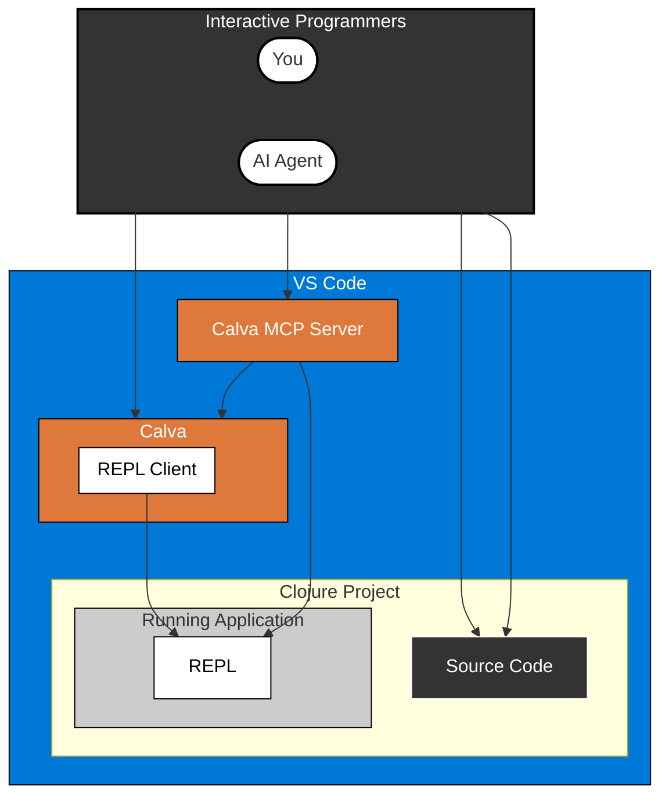

# Make CoPilot an Interactive Programmer

> Calva MCP Server

A Model Context Protocol server extension for [Calva](https://calva.io), the Clojure/ClojureScript extension for VS Code, enabling AI assistants to harness the power of the REPL.

## Why Calva MCP Server?

"I wish Copilot could actually run my Clojure code instead of just guessing what it might do."

If you've had this thought, Calva MCP Server is built for you. It transforms AI coding assistants from static code generators into interactive programming partners by giving them access to your REPL.

### Turn Your AI Assistant Into a REPL-Aware Coding Partner

Tired of AI tools that write plausible-looking Clojure that falls apart at runtime? Calva MCP Server lets your AI assistant:

- **Evaluate code in your actual environment** - No more "this might work" guesses
- **See real data structures**, not just predict their shape
- **Test functions with real inputs** before suggesting them
- **Debug alongside you** with access to runtime errors
- **Learn from your codebase's actual behavior**

### For Clojurians Who Value REPL-Driven Development

As Clojure developers, we know the REPL isn't just a console - it's the center of our workflow. Now your AI assistant can join that workflow, understanding your data and functions as they actually exist, not just as they appear in static code.

## Key Features

- Seamless integration between GitHub Copilot and your Calva REPL
- AI-driven code evaluation with full access to your project's runtime
- Interactive data exploration for smarter code suggestions
- REPL-powered debugging assistance
- Works with your existing Clojure/ClojureScript projects

## Getting Started

### Prerequisites

- [VS Code](https://code.visualstudio.com/)
- [Calva](https://marketplace.visualstudio.com/items?itemName=betterthantomorrow.calva)
- An AI coding assistant (e.g., GitHub Copilot)

### Installation

1. Install from the [VS Code Marketplace](https://marketplace.visualstudio.com/items?itemName=betterthantomorrow.calva-mcp-server)
2. Connect Calva to your Clojure/ClojureScript project
3. Start using your AI assistant with REPL superpowers!

## How It Works

Calva MCP Server implements the [Model Context Protocol](https://modelcontextprotocol.io) (MCP), creating a bridge between AI assistants and your REPL:

1. When your AI assistant needs to understand your code better, it can execute it in your REPL
2. The results flow back to the AI, giving it insight into actual data shapes and function behavior
3. This creates a powerful feedback loop where suggestions improve based on runtime information
4. You remain in control of this process, benefiting from an AI partner that truly understands your running code

## Contributing

Contributions are welcome! See our [Contribution Guidelines](CONTRIBUTING.md) for more information.

## License

[MIT](LICENSE.txt)

## Acknowledgments

- [Calva](https://calva.io) - The Clojure/ClojureScript extension for VS Code
- [Model Context Protocol](https://modelcontextprotocol.io) - The protocol enabling AI tool integration
