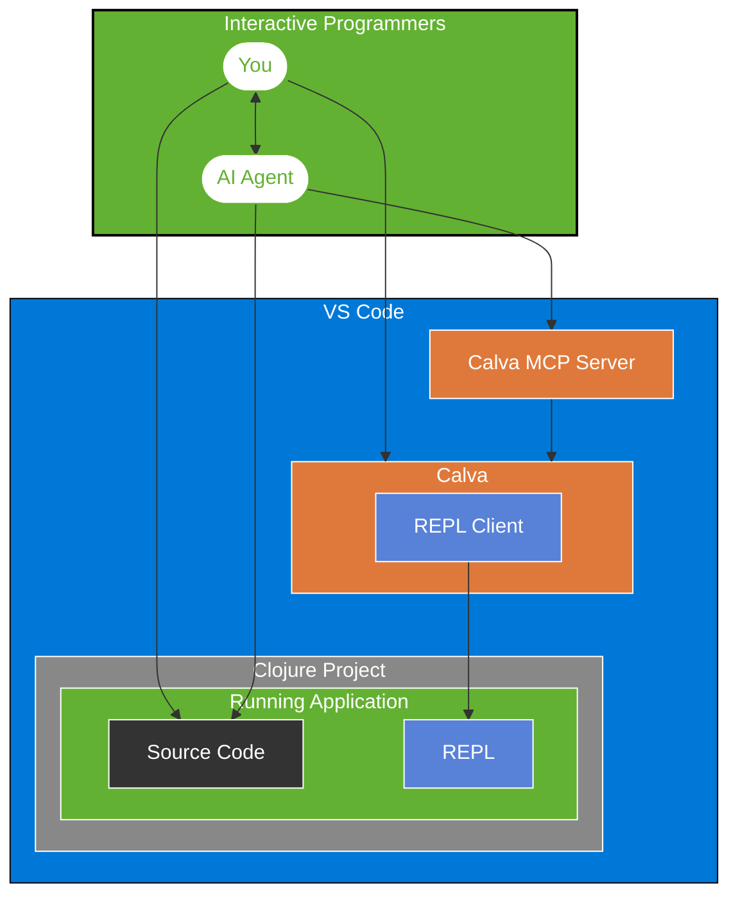

# Make CoPilot an Interactive Programmer

> Calva MCP Server

[](https://marketplace.visualstudio.com/items?itemName=betterthantomorrow.calva-mcp-server)
[](https://github.com/BetterThanTomorrow/calva-mcp-server/issues)
[](https://github.com/BetterThanTomorrow/calva-mcp-server/blob/master/LICENSE.txt)

A Model Context Protocol server extension for [Calva](https://calva.io), the Clojure/ClojureScript extension for VS Code, enabling AI assistants to harness the power of the REPL.

## Why Calva MCP Server?

"I wish Copilot could actually run my Clojure code instead of just guessing what it might do."

The Calva MCP Server transforms AI coding assistants from static code generators into interactive programming partners by giving them access to your REPL. (Please be mindful about the implications of that before you start using it.)

### Turn your AI Agent into an Interactive Programming partner

Tired of AI tools that write plausible-looking Clojure that falls apart at runtime? Calva MCP Server lets your AI assistant:

- **Evaluate code in your actual environment** - No more "this might work" guesses
- **See real data structures**, not just predict their shape
- **Test functions with real inputs** before suggesting them
- **Debug alongside you** with access to runtime errors
- **Learn from your codebase's actual behavior**

### For Clojurians who value Iiteractive Programming

As Clojure developers, we know the REPL isn't just a console - it's the center of our workflow. Now your AI assistant can join that workflow, understanding your data and functions as they actually exist, not just as they appear in static code.

## Key Features

- Seamless integration between GitHub Copilot and your Calva REPL
- AI-driven code evaluation with full access to your project's runtime (⚠️)
- Interactive data exploration for smarter code suggestions
- REPL-powered debugging assistance
- Works with your existing Clojure/ClojureScript projects

## Getting Started

### Prerequisites

- [VS Code](https://code.visualstudio.com/)
- [Calva](https://marketplace.visualstudio.com/items?itemName=betterthantomorrow.calva)
- An AI coding assistant (e.g., GitHub Copilot)
- Any Clojure environment dependencies your project has (e.g. Clojure, Babashka, etc)

### Installation

VS Code/CoPilot needs a `stdio` server to talk to. I couldn't find a way for the MCP client to start a `stdio` server inside a VS Code extension. (I don't think it is possible, really.) Thus, the Calva MCP Server is internally a socket server, which at startup writes the port it binds to to a port file. A node script (a.k.a the **wrapper**) is bundled with the extension that will start a `stdio` server wrapping the socket MCP server. The wrapper script takes the port file as an argument. Because of these and other reasons, there will be one Calva MCP server per workspace, and the port file will be written to the `.calva` directory in the workspace root.

1. Install Calva MCP Server from the Extensions pane in VS Code
1. Start the Calva MCP socket server
1. Add the MCP server config (may vary depending on MCP Client)
1. Stop the Calva MCP socket server (it's a habit to consider, at least)


#### CoPilot configuration

In you project's `.vscode/mcp.json` add a `"calva"` entry like so:
```json
{
  "servers": {
    // other servers (if any) ...
    "calva": {
      "type": "stdio",
      "command": "node",
      "args": [
        "${extensionInstallFolder:betterthantomorrow.calva-mcp-server}/dist/calva-mcp-server.js",
        "${workspaceFolder}/.calva/mcp-server/port"
      ]
    }
  }
}
```

The VS Code editor for this file is also the UI for starting and stopping the `stdio` server.

### Using

For CoPilot (or any MCP client) to use the Calva MCP Server, the socket server needs to be started before the `stdio` wrapper. For CoPilot, the latter is started from the VS Code MCP servers UI. For now the socket server needs to always be started manually.

1. Connect Calva to your Clojure/ClojureScript project
1. Issue the command: **Calva MCP Server: Start the socket server**
1. In `.vscode/mcp.json`, use the **Start** button on the `"calva"` server.
1. Start using your AI Agent with REPL superpowers!

**⚠️ NB**: You are at the mercy of the AI Agent. Using your REPL it can do anything that you can do from that REPL...

When you are done:

1. Issue the command: **Calva MCP Server: Stop the socket server**

This way your Clojure REPL is not exposed to any AI Agents (at least not by the Calva MCP Server extension).

## How It Works

Calva MCP Server implements the [Model Context Protocol](https://modelcontextprotocol.io) (MCP), creating a bridge between AI assistants and your REPL:

1. When your AI assistant needs to understand your code better, it can execute it in your REPL
2. The results flow back to the AI, giving it insight into actual data shapes and function behavior
3. This creates a powerful feedback loop where suggestions improve based on runtime information
4. You remain in control of this process, benefiting from an AI partner that truly understands your running code



## WIP

This is a super early, bare bones, MCP server. Currently it only has one tool: `evaluate-clojure-code`. And currently that tool only evaluates code towards the current REPL connection. (Typically, whatever the REPL Window prompt would use.) Also, it only receives results, so the Agent does not see `stdout`/`stderr` output.

The “plan” (hope) is that the code evaluation tool will grow more sophisticated, and that we will expose much more of Calva's features.

## Contributing

Contributions are welcome! Issues, PRs, whatever. Before a PR, we appreciate an issue stating the problem being solved. You may also want to reach out discussing the issue before starting to work on it.

## License 🍻🗽

[MIT](LICENSE.txt)

## Sponsor my open source work ♥️

You are welcome to show me you like my work using this link:

* https://github.com/sponsors/PEZ